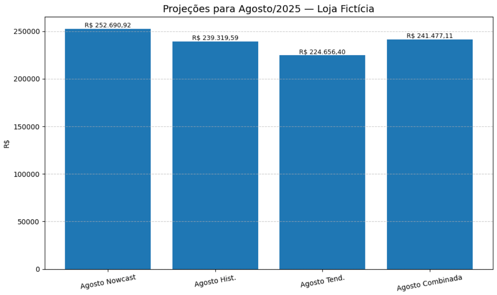

# 📊 Previsão de Vendas — Loja Fictícia (Agosto/2025)

> **Aviso:** Os dados usados neste projeto são **fictícios**, criados apenas para fins de **estudo** e **demonstração**. Não representam resultados reais da empresa.

## 🎯 Contexto do Problema
Queremos prever o total de vendas de **agosto/2025** antes do mês terminar, usando:
- Meses **fechados**: maio, junho e julho.
- **Parcial** de agosto (1º ao dia observado).

O objetivo é gerar previsões que auxiliem na **tomada de decisão antecipada**, utilizando abordagens estatísticas e de modelagem preditiva para diferentes cenários.

## 🧠 Metodologia
Foram aplicadas quatro abordagens principais e uma faixa de cenários:

1. **Nowcast (ritmo atual)** — média diária observada em agosto × 31.
2. **Histórica (média 3m)** — mantém o realizado e usa a média dos 3 meses para os dias restantes.
3. **Tendência (Regressão Linear)** — aplicação de um modelo de regressão linear simples, usando os totais de vendas de maio, junho e julho como variáveis para estimar o valor de agosto (mês 8).  
   - Esse método identifica a tendência de crescimento ou queda nas vendas e projeta o valor esperado para agosto, considerando a relação temporal entre os meses e seu comportamento histórico.
4. **Combinada (60/40)** — 60% Nowcast + 40% Tendência.
5. **Faixa (baixo/alto)** — menor/maior média diária dos 3 meses aplicada aos dias restantes.

## 📈 Exemplo de Visualização
Abaixo, exemplo de gráfico comparando todas as abordagens, incluindo a previsão via **Regressão Linear**:

Esse gráfico é gerado automaticamente ao executar o notebook, permitindo acompanhar visualmente as diferenças entre os métodos.

## 📂 Estrutura do Projeto
- **Arquivos de entrada**  
  - `historico_mensal_maio_junho_julho.csv` — histórico mensal (mês, dias_no_mes, total_vendas, media_diaria)  
  - `agosto_parcial_resumo.csv` — parcial de agosto (periodo, dias_observados, total_vendas_parcial, media_diaria_parcial)  
- **Notebook principal**  
  - `notebook_previsao_vendas.ipynb` — código completo (Google Colab / Jupyter) com comentários passo a passo.  
- **Saídas geradas automaticamente**  
  - `vendas_maio_junho_julho.png`  
  - `projecoes_agosto.png`  
  - `resultados_projecao_agosto.csv`  

## ▶️ Como Executar
1. Abra o **Google Colab** e suba `historico_mensal_maio_junho_julho.csv` e `agosto_parcial_resumo.csv`.
2. Abra o `notebook_previsao_vendas.ipynb` e execute as células na ordem apresentada.  
   - Todas as etapas possuem **comentários explicativos** para facilitar a compreensão.
3. Para **atualizar diariamente**: edite `agosto_parcial_resumo.csv` (campos `dias_observados` e `total_vendas_parcial`) e rode novamente o notebook.

## 📜 Licença
MIT — uso livre para fins de estudo.
